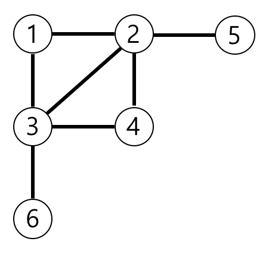

가장 먼 노드
================
[문제링크](https://programmers.co.kr/learn/courses/30/lessons/49189)  
_연관태그: #BFS,#깊이우선탐색,#그래프_
***

## + 난이도: 3

## 문제 설명
n개의 노드가 있는 그래프가 있습니다. 각 노드는 1부터 n까지 번호가 적혀있습니다. 1번 노드에서 가장 멀리 떨어진 노드의 갯수를 구하려고 합니다. 가장 멀리 떨어진 노드란 최단경로로 이동했을 때 간선의 개수가 가장 많은 노드들을 의미합니다.  

노드의 개수 n, 간선에 대한 정보가 담긴 2차원 배열 vertex가 매개변수로 주어질 때, 1번 노드로부터 가장 멀리 떨어진 노드가 몇 개인지를 return 하도록 solution 함수를 작성해주세요.  

### 제한사항
* 노드의 개수 n은 2 이상 20,000 이하입니다.
* 간선은 양방향이며 총 1개 이상 50,000개 이하의 간선이 있습니다.
* vertex 배열 각 행 [a, b]는 a번 노드와 b번 노드 사이에 간선이 있다는 의미입니다.

### 입출력 예
```
n	vertex	return
6	[[3, 6], [4, 3], [3, 2], [1, 3], [1, 2], [2, 4], [5, 2]]	3
```

### 입출력 예 설명
예제의 그래프를 표현하면 아래 그림과 같고, 1번 노드에서 가장 멀리 떨어진 노드는 4,5,6번 노드입니다.  



***

## 문제 풀이
먼저 vertex 형식으로 주어지는 입력값을 graph형태로 변환하여 좀더 직관적으로 다룰 수 있게 
VertexToGraph 함수를 정의한다.  
해시테이블과 유사한 딕셔너리 구조를 활용하여 노드가 어떤 노드로 연결될 수 있는지 값을 입력시키고 해당 딕셔너리를 반환한다.

가장 멀리 떨어진 노드를 탐색하기 위해서는 가장 깊이 들어가봐야 하기 때문에 깊이우선탐색(BFS)를 적용하는것이 가장 합리적인 방법이라고 생각되었다.  
깊이우선탐색을 구현하기 위해 dequeue를 활용하였으며 해당 메타구조를 파이썬의 collection에서 불러와 사용하였다.  

깊이우선탐색을 통해 모든 깊은 노드들의 깊이값을 저장하는데 성공했다면, 그중 가장 깊은 깊이값의 갯수를 구해 정답으로 반환한다.